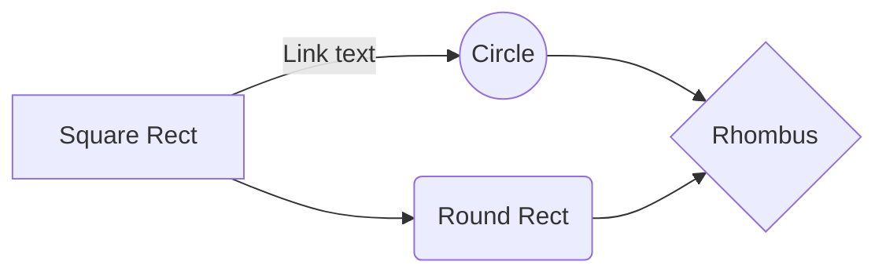

# steam-query-java
Java Library that queries Steam's Master Servers.

## Requirements
* JUnit 5.0

And this will produce a flow chart:

```mermaid
graph LR
A[Square Rect] -- Link text --> B((Circle))
A --> C(Round Rect)
B --> D{Rhombus}
C --> D
```